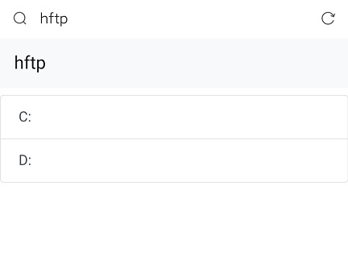

# hftp

A program that maps a specified folder on a computer to a http service based on **Django**, which can be used for LAN device previews, downloads, and so on.

**Usage**(Python and django need to be installed on your computer)

In cmd:
``` 
git clone https://github.com/punnpkin/hftp.git
cd hftp
python manage.py runserver 0:80
```

Then in your phone (or other device in same LAN)

Enter the IP addr of your PC in the browser address bar to see all the disk drives, and then click any item to enter the appropriate directory.

